# 🚗 Car Insurance Mobile App – ITCS444

A Flutter-based mobile application that allows customers to register and insure vehicles, while administrators manage insurance requests, policies, and claims. Developed for the ITCS444 Mobile App Development course, University of Bahrain – Second Semester 2024/2025.

---

## 📁 File Structure

```
car_insurance_app/
├── lib/
│   ├── app.dart                     # App root widget
│   ├── main.dart                    # Entry point
│   ├── core/
│   │   ├── constants.dart
│   │   └── theme.dart
│   ├── models/
│   │   └── car.dart
│   ├── screens/
│   │   ├── auth/
│   │   │   ├── login_page.dart
│   │   │   └── signup_page.dart
│   │   ├── home/
│   │   │   └── home_page.dart
│   │   ├── vehicle/
│   │   │   ├── register_vehicle.dart
│   │   │   └── vehicle_list.dart
│   │   ├── admin/
│   │   │   └── admin_requests_page.dart
│   │   ├── claims/
│   │   │   └── report_accident_page.dart
│   │   └── policy/
│   │       └── policy_page.dart
│   ├── services/
│   │   ├── auth_service.dart
│   │   ├── vehicle_service.dart
│   │   └── insurance_service.dart
│   └── widgets/
│       ├── custom_text_field.dart
│       └── vehicle_card.dart
├── pubspec.yaml
```

---

## 🚀 Getting Started

### 🔧 Clone & Run

```bash
git clone https://github.com/7ax/car_insurance_app.git
cd car_insurance_app
flutter pub get
flutter run
```

Make sure you have Flutter SDK installed and set up. If not, follow the [Flutter installation guide](https://flutter.dev/docs/get-started/install).

---

## 👥 Team Members

| Student ID | Name              | Section | GitHub Username |
|------------|-------------------|--------|------------------|
| 202201254  | Husain Maki       | 2      | @7ax |
| 202100358  | Husain Merza      | 2      | @Husain1771-2         |
| 202102423  | Ali Abuhamad      | 2      | @Ali-code75 |
| 202105051  | Husain Alabed     | 2      | @HusainNit |
| 202107999  | Mohamed Khalaf    | 1      | @mjkhalaf1 |

---

## 📱 Key Features

- 🔐 Secure login with role-based access (Admin/Customer)
- 🚘 Car registration with depreciation-based insurance
- 🛠 Admin dashboard to view & respond to requests
- 📋 Accident reporting & claims management
- 💑 Insurance policy reports (current + past)
- 🔔 Push notifications & progress tracking
- 🎨 Clean and responsive UI with smooth UX

---

## 📸 Screenshots

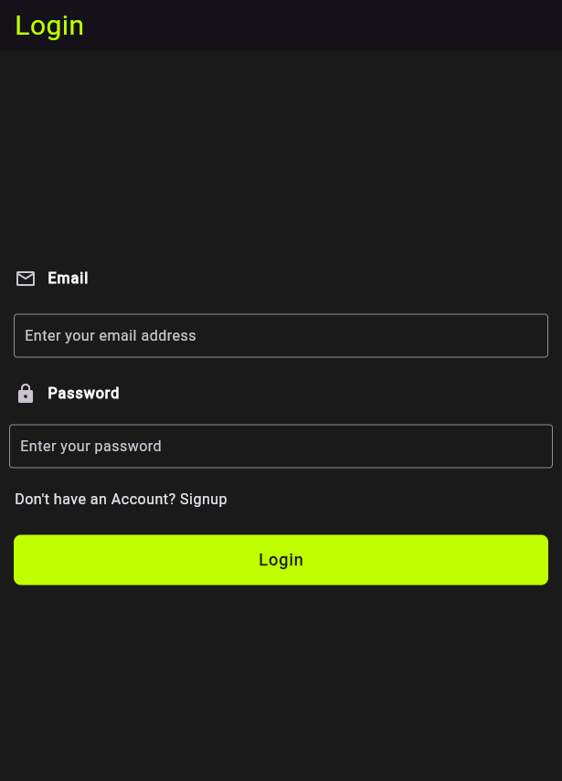
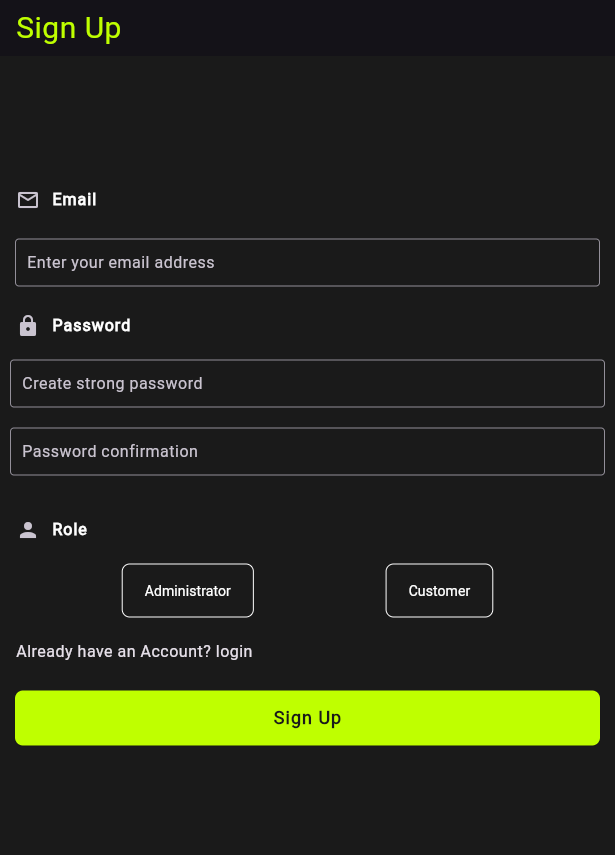
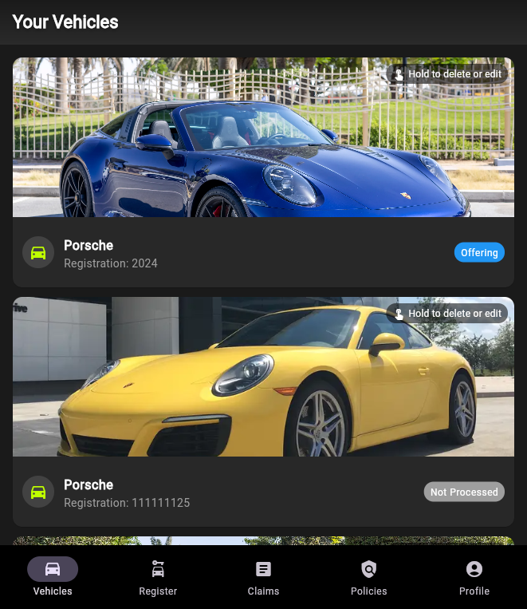
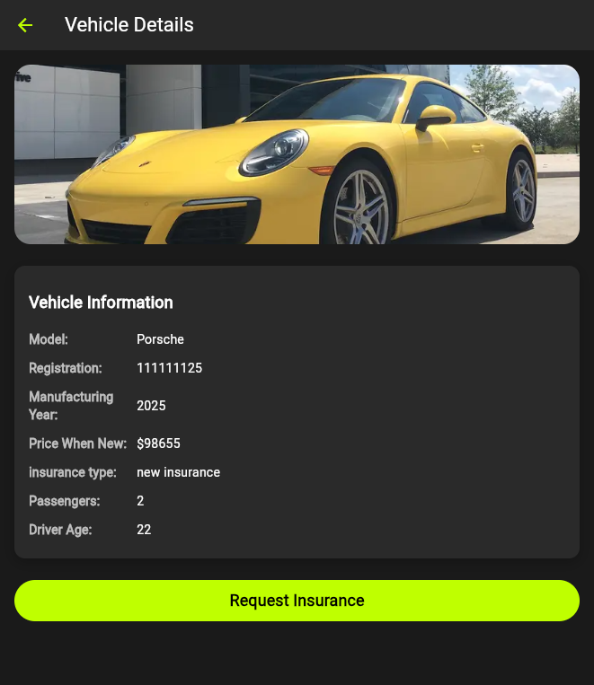
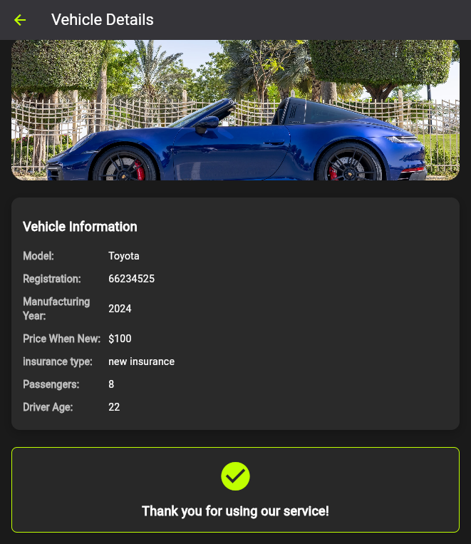

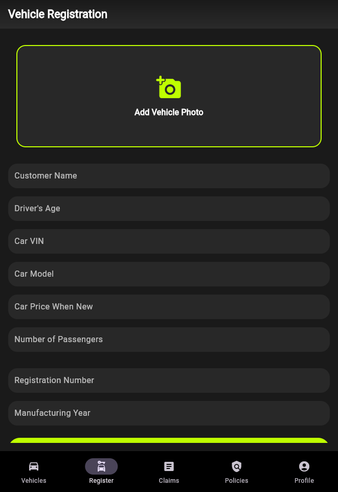
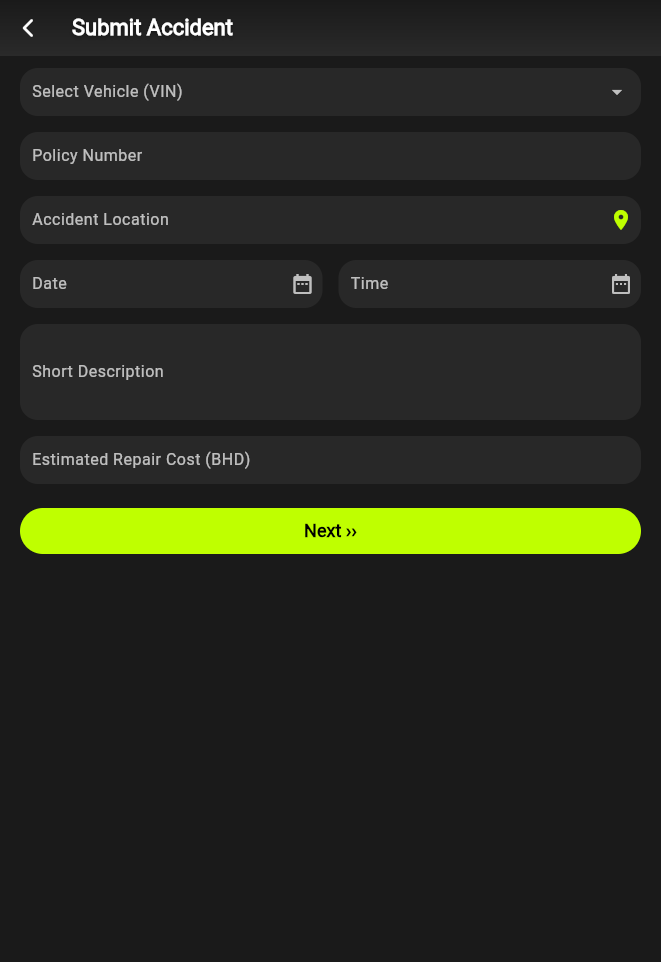
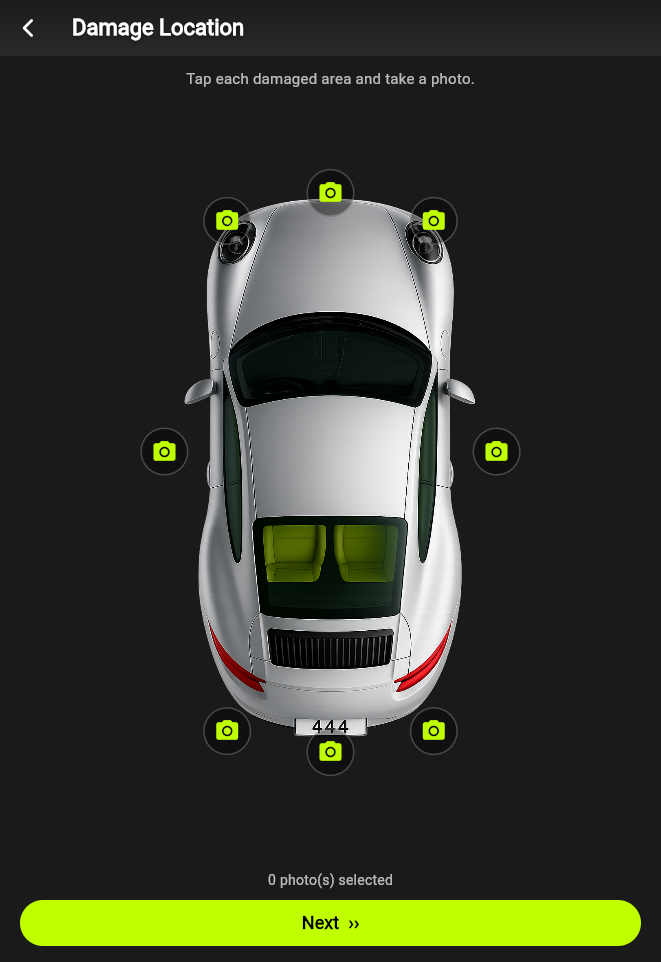
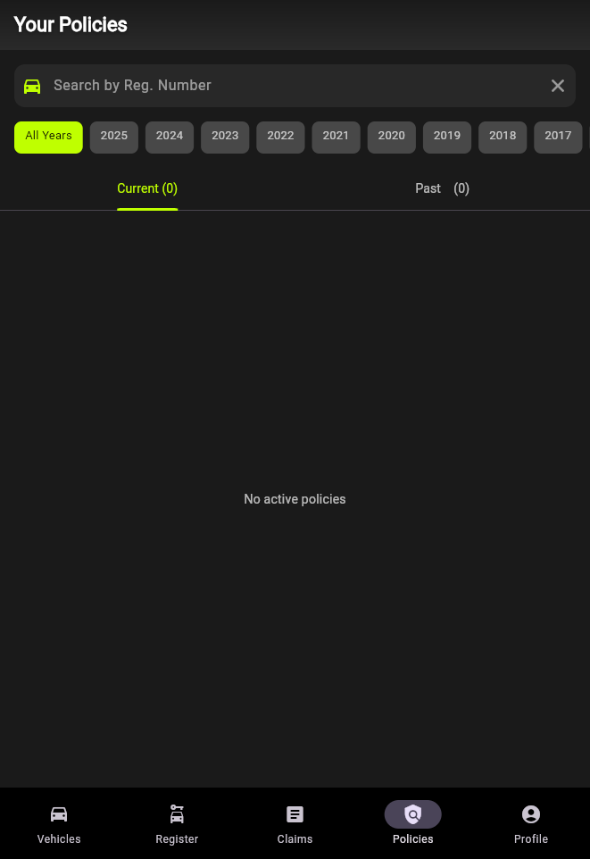
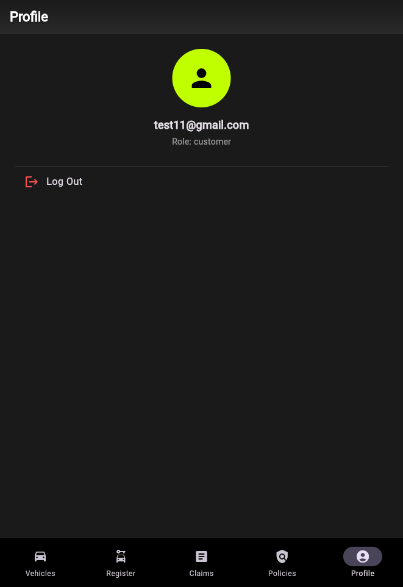
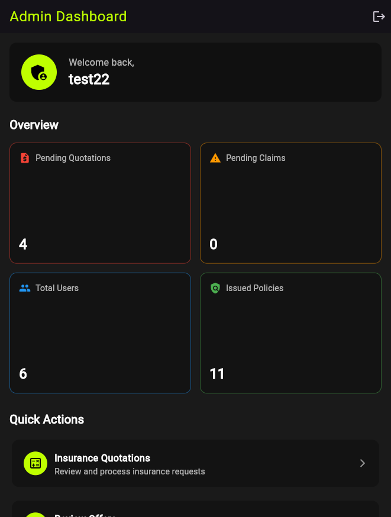
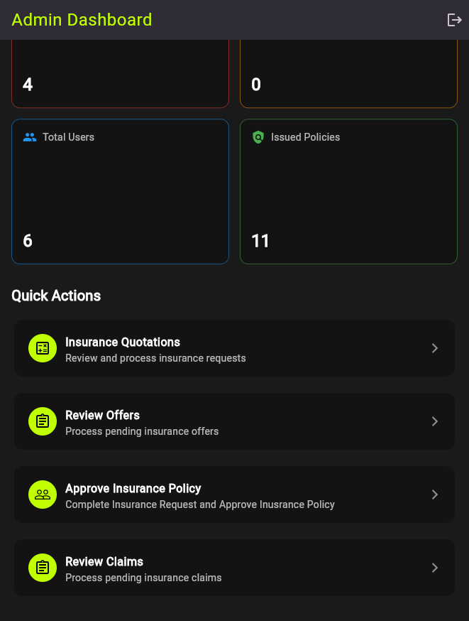
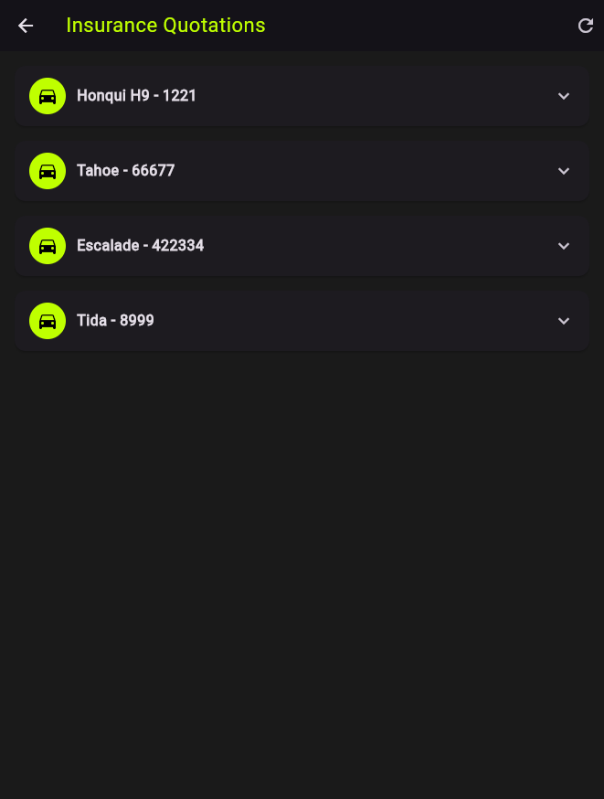


---

## 📄 License

This project is for educational purposes only under University of Bahrain ITCS444.
